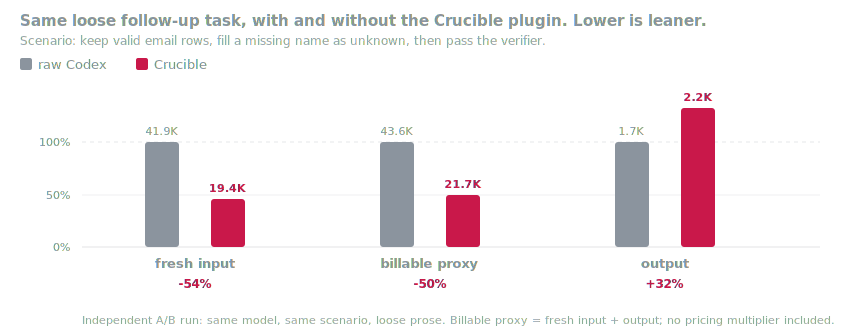

<p align="center">
  <picture>
    
  </picture>
</p>

<h1 align="center">crucible</h1>

**Codex turns proven work into learning signal.**

Crucible is a Codex plugin for work that should leave evidence behind.

It gives Codex a working shape:

```text
attempt -> check -> evidence -> promotion
```

Codex still writes, repairs, and explains. Crucible makes the useful parts survive the session.

## The Product

Most agent work disappears into a chat transcript.

That is fine for a one-off fix. It is weak for research, evaluation, and training, where the useful object is not only the answer. The useful object is the attempt, the check, the failure, the repair, and the reason it was worth keeping.

Crucible turns that into a row with a trail.

```text
repo -> task -> attempt -> check -> evidence -> learning row
```

A failed attempt is not waste. It shows where the model's path bent away from the verifier. A repair is not just a patch. It is the correction the next model should see.

```text
The question changes from:
"Did Codex finish?"

to:
"What did this run prove?"
```

That is the product: not a larger agent, a cleaner loop.

## The Rule

```text
No reward without a verifier.
```

A verifier is the boundary between a plausible answer and a usable signal. It stays close to the project, because the project knows what truth looks like.

## The Numbers

The honest measurement is a real Codex session doing real follow-up work.

The task: fix an ingress-normalization bug where a valid email with a missing name should stay in the dataset as `unknown`. Same model, same loose user prompt, same verifier. One arm gets a plain task folder. One arm gets a locked Crucible pack with failing evidence and a `next` brief.



vs raw Codex baseline: fresh input `-54%`, billable proxy `-50%`, output `+32%`, verifier pass `100%`.

Numbers live in [examples/numbers/](examples/numbers/). Cost is only real when the run includes token usage, model name, and current per-token pricing.

## The Shape

Without a harness, the operator carries the run in their head.

```text
read task -> inspect attempt -> run check -> read logs -> judge failure -> write repair -> decide what stays
```

Crucible moves the repeatable parts into the artifact.

```text
operator load

before Crucible  |████████████████████████████████████████| everything
after Crucible   |████████                                | promote or reject
                  the trail carries the rest
```

The loop does not become magic. It becomes smaller in the place that used to be most expensive.

## The Operator Split

```text
Codex proposes.
Crucible checks.
The human promotes.
```

Codex may draft the task, verifier, patch, or repair. Crucible runs the check and records the result. The human keeps the gate where judgment belongs.

The useful boundary is simple: Codex can help make the evidence, but it does not quietly approve its own lesson.

## Why It Feels Easier

Crucible meets Codex where it already works.

Install the plugin:

```bash
codex plugin marketplace add dunkeln/crucible
```

Then ask Codex for a checked task, a verifier-backed repair, or a learning row. The plugin points Codex at the harness instead of making it invent the same scaffold every time.

## What Works Today

The plugin, harness, locked task pack, and benchmark card are in this repo.

Codex gets a stable factory instead of inventing the same task shape every time. The harness keeps the evidence trail. The public proof lives in [examples/numbers/](examples/numbers/), and the operator commands live in [harness/README.md](harness/README.md).

## Built For Codex

Crucible is installed as a Codex plugin, then used inside the repo where the work already happens.

The skill tells Codex how to behave: inspect first, choose the seam, use the harness, and report evidence. It stays small so Codex loads the workflow, not the whole repo story.

## Contributing

Read [CONTRIBUTING.md](CONTRIBUTING.md) before changing the repo.

The short rule:

```text
pick one seam, prove it with evidence, and stop
```

Small first. Objective always. Promotion only when the evidence earns it.
